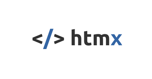
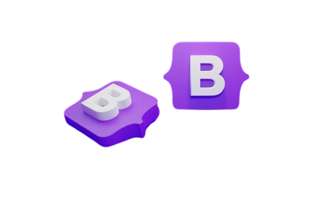

# Hello there! 👋

Welcome to my GitHub profile! I'm Funmilayo, a Frontend Developer with a love for coding and building wonderful projects.

## About Me

- 🚀 I'm currently freelancing and looking for a fulltime remote Frontend Role.
- 💻 I enjoy working with technologies like JavaScript, React, React Native, and Python.
- 🌱 I'm constantly learning and exploring new technologies to expand my skills.
- 💬 Ask me about anything related to web development, software engineering, or technology in general. I'm always happy to help!
- 📫 You can reach me via [Email](mailto:fayemi.funmilayo55@gmail.con) or connect with me on [LinkedIn](https://www.linkedin.com/in/yourprofile).
- ⚡ Fun fact: Vim is my favorite text editor 😂

Feel free to explore my repositories to see some of my work!

## Technologies and Tools I use 

   

<h2>&nbsp; &nbsp;  &nbsp; *** Connect with me ***  </h2>

## GitHub Stats

## Let's Connect

- LinkedIn: [My LinkedIn](https://www.linkedin.com/in/yourprofile)
- Website: [Funmi's Portfolio](https://funmi-folio.vercel.app)
- Twitter: [See Me on Twitter](https://twitter.com/Funmi565)

Thanks for visiting my profile! Feel free to reach out and connect.
